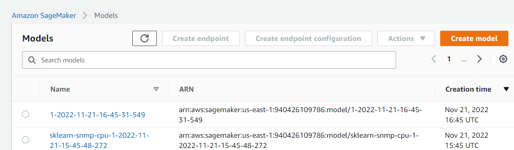
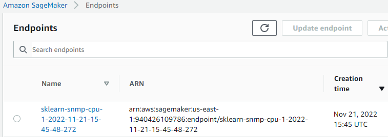
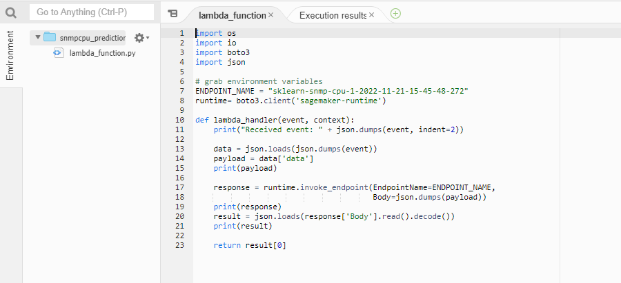
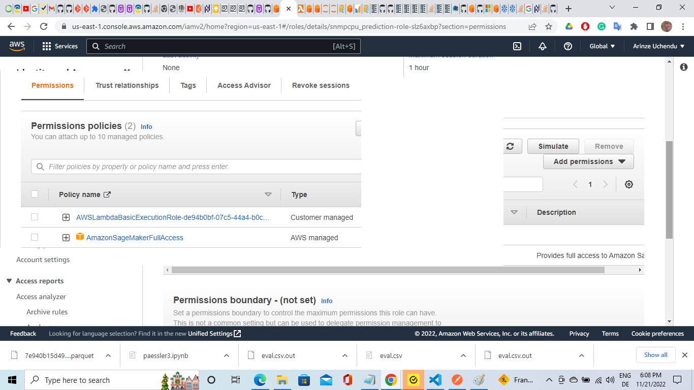
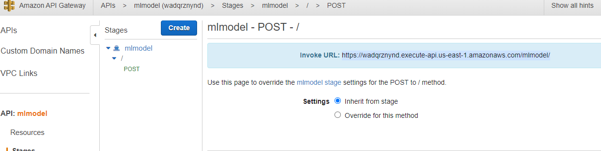
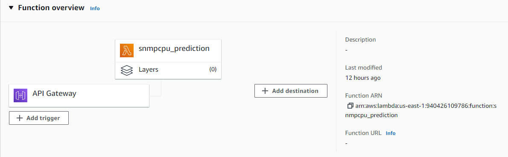
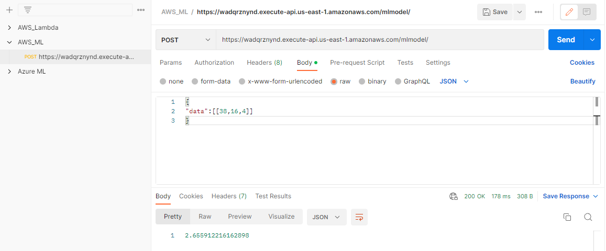
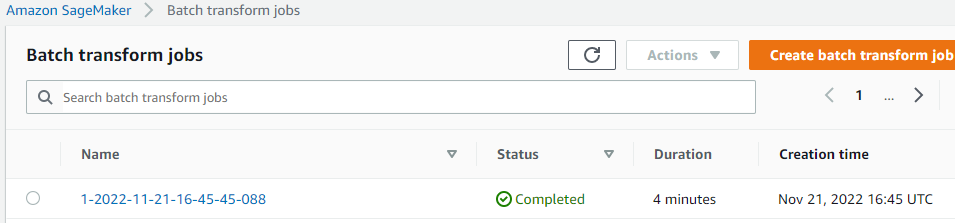
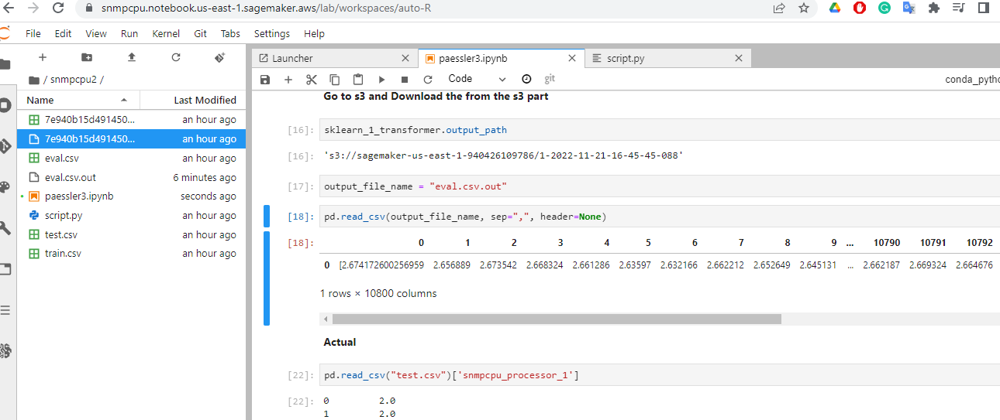

# Presentation 
**Task:**
* Take network card inbound traffic of some device, and predict the CPU load of the same device using linear regression

After doing this on my Laptop, I used sagemaker notebook with `ml.t3.medium` instance.

## Data

The data was gotten from Paessler AG's prtg-open-dataset for company with company_id=1 with [sensor_id=422](https://github.com/PaesslerAG/prtg-open-dataset/tree/main/data/snmpcpu/company_id%3D1/sensor_id%3D422)
Thus only analysing 1 sensor in a company.

The SNMP CPU Load sensor monitors the system load via the Simple Network Management Protocol (SNMP).

### Understanding the data

In github, data was arranged in folders and also it is in parquet format. 
This data has 35 columns with 32 processors, an Id of 1, total cpu load of the 32 processors used and a timestamp representing 43198 instances for 1 month period, from `2021-06-01 00:00:26`	 to `2021-06-30 23:59:55`.

out of these 32 processors, only 1 was used in this time period.

### Preprocessing

Data was converted to CSV to enable Batch processing job in AWS Sagemaker. Thus to be able to predict multiple files using the trained model.
Though in this example only one file was used.

```py
df=pd.read_parquet("7e940b15d4914503a2c42e3e75ac196c.parquet")
df=df.to_csv("7e940b15d4914503a2c42e3e75ac196c.csv")
df=pd.read_csv("7e940b15d4914503a2c42e3e75ac196c.csv")
```

Preprocessing steps done here includes:
* Extracting `day of week`, `hour`,`minutes`.
* Selecting `day of week`, `hour`,`minutes` as features for prediction.
  
```py
df['ts']=pd.to_datetime(df['ts'])
data_cpu=df.drop('Unnamed: 0',axis=1)

#data_cpu['day']=data_cpu['ts'].dt.day
data_cpu['day_of_week']=data_cpu['ts'].dt.day_of_week.astype(np.float)
data_cpu['hour']=data_cpu['ts'].dt.hour.astype(np.float)
data_cpu['minutes']=data_cpu['ts'].dt.minute.astype(np.float)
#data_cpu['date']=data_cpu['ts'].dt.strftime("%Y-%m-%d")
#data_cpu['date']=pd.to_datetime(data_cpu['date'])

time_series=data_cpu[['minutes','hour','day_of_week','snmpcpu_processor_1','date']]
time_series=time_series.drop('date',axis=1)

columns=list(time_series.columns)
```

My data was slit into train and test set, but test set was duplicated to x_eval for batch processing job.

```py
x_train, x_test = train_test_split(time_series, test_size=0.25)
x_eval = x_test[['minutes', 'hour', 'day_of_week',]]
x_train.to_csv("train.csv")
x_test.to_csv("test.csv")
x_eval.to_csv("eval.csv", header=False, index=False)
```

**Data uploaded to S3 bucket**

```py
trainpath = sagemaker_session.upload_data(
    path="train.csv", bucket=bucket, key_prefix="sagemaker/sklearn-train"
)

testpath = sagemaker_session.upload_data(
    path="test.csv", bucket=bucket, key_prefix="sagemaker/sklearn-train"
)

#print(trainpath)
#print(testpath)

sagemaker_session.upload_data(
    path="eval.csv", bucket=bucket, key_prefix="sagemaker/sklearn-eval"
)
eval_s3_prefix = f"s3://{bucket}/sagemaker/sklearn-eval/"
```

## Training

Using a Training script,`script.py`, using Linear Regression for this training.

```py
%%writefile script.py

import argparse
import joblib
import os

import numpy as np
import pandas as pd
from sklearn.linear_model import LinearRegression
import logging
import sys

logger = logging.getLogger(__name__)
logger.setLevel(logging.DEBUG)
logger.addHandler(logging.StreamHandler(sys.stdout))


# inference functions ---------------
def model_fn(model_dir):
    clf = joblib.load(os.path.join(model_dir, "model.joblib"))
    return clf


if __name__ == "__main__":

    print("extracting arguments")
    parser = argparse.ArgumentParser()


    # Data, model, and output directories
    parser.add_argument("--model-dir", type=str, default=os.environ.get("SM_MODEL_DIR"))
    parser.add_argument("--train", type=str, default=os.environ.get("SM_CHANNEL_TRAIN"))
    parser.add_argument("--test", type=str, default=os.environ.get("SM_CHANNEL_TEST"))
    parser.add_argument("--train-file", type=str, default="train.csv")
    parser.add_argument("--test-file", type=str, default="test.csv")
    parser.add_argument(
        "--features", type=str
    )  # in this script we ask user to explicitly name features
    parser.add_argument(
        "--target", type=str
    )  # in this script we ask user to explicitly name the target

    args, _ = parser.parse_known_args()

    print("reading data")
    train_df = pd.read_csv(os.path.join(args.train, args.train_file))
    test_df = pd.read_csv(os.path.join(args.test, args.test_file))

    print("building training and testing datasets")
    X_train = train_df[args.features.split()]
    X_test = test_df[args.features.split()]
    y_train = train_df[args.target]
    y_test = test_df[args.target]

    # train
    print("training model")
    model =LinearRegression() 

    model.fit(X_train, y_train)

    # print abs error
    print("validating model")
    abs_err = np.abs(model.predict(X_test) - y_test)
    logger.info(f"Absolute Error: {abs_err}")


    # persist model
    path = os.path.join(args.model_dir, "model.joblib")
    joblib.dump(model, path)
    print("model persisted at " + path)
    logger.info(f"model persisted at {path}")
```

logger was used so that I could monitor training and performance in `aws cloud watch`.

Other things to take note includes, model directory, train and test channels. Also train and test data was passed.
After which model was saved and logged to see the path.

We use the Estimator from the SageMaker Python SDK.
```py

from sagemaker.sklearn.estimator import SKLearn

FRAMEWORK_VERSION = "1.0-1"
training_job_1_name = "sklearn-snmp-cpu-1"

sklearn_estimator_1 = SKLearn(
    entry_point="script.py",
    role=get_execution_role(),
    instance_count=1,
    instance_type="ml.m5.xlarge",
    framework_version=FRAMEWORK_VERSION,
    base_job_name=training_job_1_name,
    metric_definitions=[{"Name": "median-AE", "Regex": "AE-at-50th-percentile: ([0-9.]+).*$"}],
    sagemaker_session=sagemaker_session,
    hyperparameters={
        "features": "minutes hour day_of_week",
        "target": "snmpcpu_processor_1",
    },
)
```
I passed the features and target parameters. also `ml.m5.xlarge` instance was used for training.

Then I performed model fitting.
```py
sklearn_estimator_1.fit({"train": trainpath, "test": testpath})
```


I then deployed this model.
```py
predictor=sklearn_estimator_1.deploy(initial_instance_count=1,instance_type='ml.m5.xlarge')
```



Perfomed a CSVSerializer on the endpoint.
Something to note, in this example, this can work without Serializing it.

```py
predictor.serializer = sagemaker.serializers.CSVSerializer()
```
data used for testing endpoint.
```py
inputs=x_eval.sample(5).values
```
|minutes|hour|day of week|
|---|---|---|
|36|0|5|
|1|14|1|
|45|9|5|
|35|10|3|
|53|10|1|
    
```py
x_pred=predictor.predict(inputs)
x_pred
```
array([2.70718733	2.63649008	2.69301744	2.6738877	2.67088027])

## Lambda

I created a test event
```json
{
  "data": [
    [
      38,
      16,
      4
    ]
  ]
}
```
with created lambda event handler

Passing my endpoint name with sagemaker runtime.

Also I attached SagemakerFullAccess policy to this lambda's IAM role.


## Serving the Endpoint

Using API Gateway, I created push request, so that I will be able to get the url I can used to integrate it into an application.





Then I tested my Endpoint using Postman.


## Batch Transform job

**Register the model of the training job in the Model Registry***

Once the model is registered, you will see it in the Model Registry tab of the SageMaker Studio UI. The model is registered with the approval_status set to "Approved". By default, the model is registered with the approval_status set to PendingManualApproval. Users can then navigate to the Model Registry to manually approve the model based on any criteria set for model evaluation or this can be done via API.
```py
import boto3
import time

client = boto3.client("sagemaker")

model_package_group_name = "sklearn-snmp-cpu" + str(round(time.time()))
model_package_group_input_dict = {
    "ModelPackageGroupName": model_package_group_name,
    "ModelPackageGroupDescription": "My sample sklearn model package group",
}

create_model_pacakge_group_response = client.create_model_package_group(
    **model_package_group_input_dict
)
model_package_arn = create_model_pacakge_group_response["ModelPackageGroupArn"]
print(f"ModelPackageGroup Arn : {model_package_arn}")
```

Create a transform job with the default configurations from the model of the  training job
```py
sklearn_1_transformer = model_package_1.transformer(
    instance_count=1, instance_type=inference_instance_type
)
sklearn_1_transformer.transform(eval_s3_prefix, split_type="Line", content_type="text/csv")
```


Let's inspect the output of the Batch Transform job in S3. It should show the CPU in block group.

**Go to s3 and Download the from the s3 part**

```py
sklearn_1_transformer.output_path
```

```py
output_file_name = "eval.csv.out"
```

Display the predicted values.
```py
pd.read_csv(output_file_name, sep=",", header=None)
```
10,800 predicted values of target variable `snmpcpu_processor_1` was displayed.



## References

* [SNMP CPU Load sensor monitors](https://www.paessler.com/manuals/prtg/snmp_cpu_load_sensor)
* [Batch Transformation](https://github.com/aws/amazon-sagemaker-examples/blob/main/sagemaker-python-sdk/scikit_learn_model_registry_batch_transform/scikit_learn_model_registry_batch_transform.ipynb)